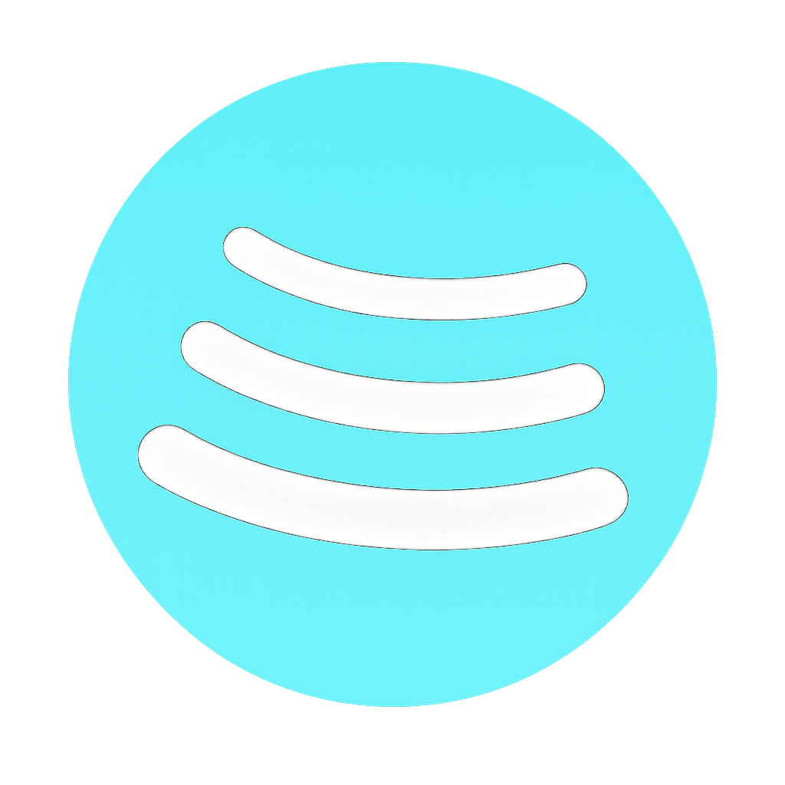
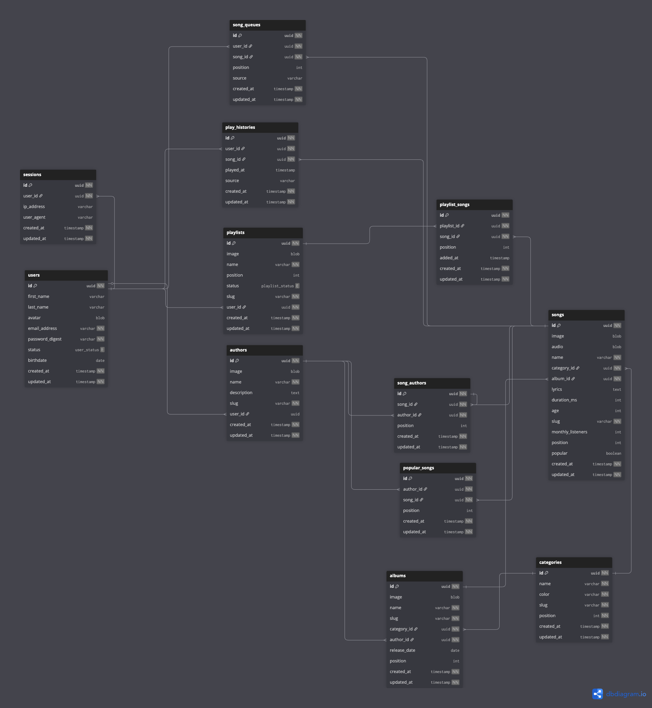

#  Spotsby

An Open Source personal music player.

## Stack

- Ruby 3.4.7 / Rails 8.0 (importmap, propshaft, Hotwire)
- PostgreSQL 16
- Redis (development, via the dev container)
- Solid Queue / Solid Cache / Solid Cable (production)
- RSpec, FactoryBot, Capybara + remote Selenium (Chromium)
- Kamal for deploy

Versions are pinned in `.ruby-version` and `.tool-versions`.

## Getting started

There are two supported paths: the **dev container** (recommended — everything in Docker) and a **local install**.

### Option A — Dev container (recommended)

The dev container brings up the Rails app, PostgreSQL 16, Redis, and a Selenium Chromium node ready for system specs. Compose config lives in `.devcontainers/`.

Prerequisites:

- Docker Desktop (or Docker Engine + Compose v2)
- VS Code with the **Dev Containers** extension (optional, but smoothest)

#### With VS Code

1. Open the project in VS Code.
2. Run **Dev Containers: Reopen in Container** from the command palette. Point it at `.devcontainers/devcontainer.json`. The first build pulls images, installs system deps, and runs `bundle install` (`postCreateCommand`).
3. Inside the container shell:
   ```bash
   bin/rails db:prepare
   bin/rails db:seed   # optional
   bin/dev
   ```
4. App is on http://localhost:3000.

#### With plain Docker Compose

```bash
docker compose -f .devcontainers/docker-compose.yml up -d
docker compose -f .devcontainers/docker-compose.yml exec web bash

# inside the web container:
bin/rails db:prepare
bin/dev
```

The compose file already sets `DATABASE_URL=postgres://postgres:postgres@db` and `REDIS_URL=redis://redis:6379/1` for the `web` service — you do **not** need to put those in `.env`.

### Option B — Local install

Prerequisites:

- Ruby 3.4.7 (use `asdf` or `rbenv` with `.ruby-version`)
- Node.js 22.14.0 (`.tool-versions`) — only needed if you regenerate assets
- PostgreSQL 16 running locally
- `libvips` for ActiveStorage image processing — `brew install vips` on macOS

Then:

```bash
bundle install
cp env.example .env   # fill in DATABASE_URL, RAILS_MASTER_KEY, etc.
bin/setup             # bundle check + db:prepare + log:clear + bin/dev
```

`bin/setup` is idempotent — re-run it any time.

## Environment variables

Copy `env.example` to `.env` and fill in:

| Var | Required when | Notes |
|---|---|---|
| `DATABASE_URL` | local install | Not needed in the dev container — set by compose |
| `RAILS_MASTER_KEY` | using encrypted credentials | Get from a teammate; pairs with `config/master.key` |
| `SPOTSBY_HOST` | deploying with Kamal | Production host |
| `KAMAL_REGISTRY_USERNAME` / `KAMAL_REGISTRY_PASSWORD` | deploying with Kamal | Docker Hub creds |

`.env` is gitignored — never commit it.

## Common commands

```bash
bin/dev                       # boot the server (port 3000)
bin/rails console
bin/rails db:migrate
bin/rails db:seed
bin/rails db:prepare          # create + migrate + seed (idempotent)
bin/jobs                      # run the Solid Queue worker

bundle exec rspec             # full test suite
bundle exec rspec spec/models # one slice
bin/rubocop
bin/brakeman                  # security scan
```

System specs run against the `selenium` service in the dev container — no local Chromedriver needed when using Option A.

## Deploy

Kamal config lives in `config/deploy.yml` and `.kamal/`. Wrap commands with `dotenv` so `.env` is loaded:

```bash
dotenv -- bin/kamal deploy
```

## Design system

UI work follows `DESIGN.md` — color tokens, type scale, spacing, and component patterns are defined there. Don't introduce new colors or fonts outside it.

## Database schema



## Contrib ideas

- Make Public Playlists importable (heartable)
- Make public playlists clonnable
- Make playlists public by edditing them.
- Download Songs
- Download Albums
- Download Playlists
- Create a System Based user for attaching public Playlists. Create Playlists for all categories
- Enhance Player across devices
- Sound Equalyzer
- Inline playlist name edit for the playlist owner only (use Pundit)
- Authors can create their own albums and songs without admin access
- Whisper-based song lyrics
